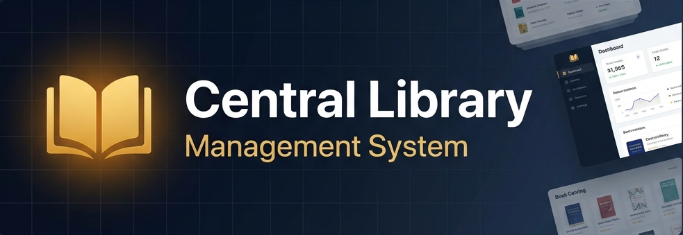
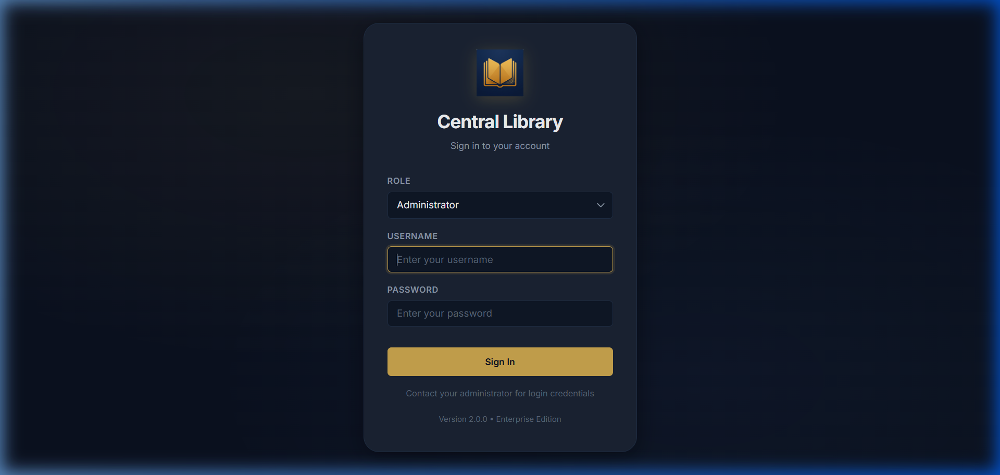
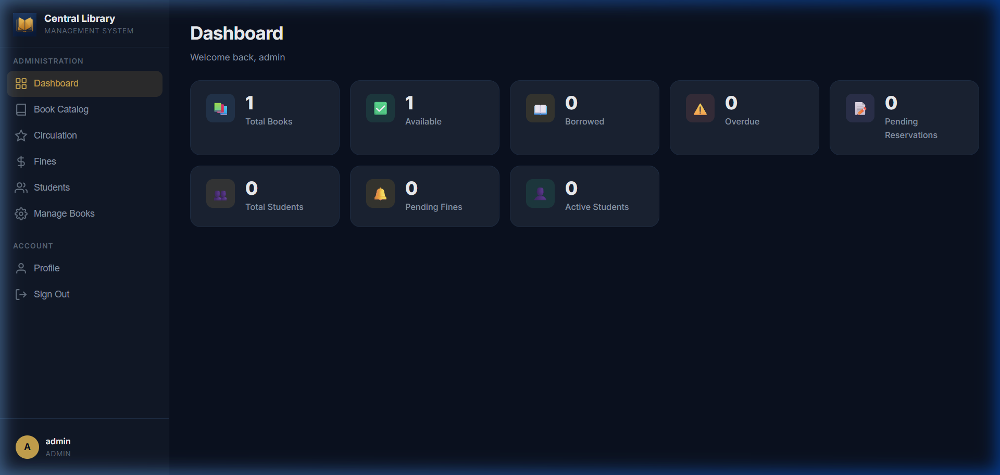
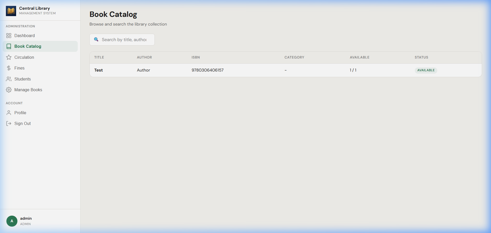
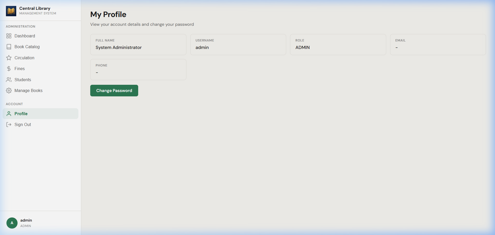

<p align="center">
  
</p>

<p align="center">
  <a href="https://www.oracle.com/java/"></a>
  <a href="#"></a>
  <a href="#"></a>
  <a href="#"></a>
  <a href="LICENSE"></a>
</p>

<p align="center">
  <b>Enterprise-grade library management for universities.</b><br/>
  Desktop GUI · REST API · Installable PWA · Native Windows Installer
</p>

---

## What is this?

A full-stack Library Management System written entirely in Java 21. It serves a university's central library — handling book inventory, student accounts, circulation (issue/return/renew), fines, reservations, notifications, and audit logs.

Two interfaces, one backend:

- **Desktop Application** — Rich Swing GUI powered by FlatLaf, starts in light theme with a dark mode toggle.
- **Web Application** — Responsive PWA served by an embedded Javalin web server. Works on phones, tablets, and desktops. Installable via "Add to Home Screen."

Both share the same service layer, so data stays consistent regardless of which interface you use.

---

## Screenshots

<p align="center">
  
  &nbsp;
  
</p>
<p align="center">
  
  &nbsp;
  
</p>

---

## Quick Start

```bash
git clone https://github.com/Surajsharma0804/Library-Management-System.git
cd Library-Management-System
mvn clean package
```

**Run the desktop app:**
```bash
java -jar target/library-management-system-1.0.0.jar
```

**Run the web server (PWA):**
```bash
java -cp target/library-management-system-1.0.0.jar com.library.WebMain
# → http://localhost:8080
```

**Default admin login:**

| Field | Value |
|-------|-------|
| Username | `admin` |
| Password | `admin@123` |

> Students don't self-register. The admin creates their account and hands them a username + temporary password. They change it on first login.

---

## How It's Built

```
┌──────────────────────────────────────────────────────────┐
│                      Clients                             │
│  ┌──────────────┐    ┌──────────────┐                    │
│  │ Swing Desktop│    │ PWA (Browser)│                    │
│  └──────┬───────┘    └──────┬───────┘                    │
│         │                   │                            │
│         ▼                   ▼                            │
│  ┌──────────────┐    ┌──────────────┐                    │
│  │  GUI Panels  │    │  REST API    │                    │
│  │  (FlatLaf)   │    │  (Javalin)   │                    │
│  └──────┬───────┘    └──────┬───────┘                    │
│         │                   │                            │
│         └─────────┬─────────┘                            │
│                   ▼                                      │
│          ┌────────────────┐                              │
│          │ LibraryFacade  │  ← single composition root   │
│          └────────┬───────┘                              │
│                   ▼                                      │
│          ┌────────────────┐                              │
│          │   Services     │  ← business rules, RBAC      │
│          └────────┬───────┘                              │
│                   ▼                                      │
│          ┌────────────────┐                              │
│          │ Repositories   │  ← JSON file persistence     │
│          └────────────────┘                              │
└──────────────────────────────────────────────────────────┘
```

No layer skips another. Controllers never touch files. Services never render UI. Repositories hold zero business logic.

---

## Features

### For Administrators
- Register students and staff (no public self-registration)
- Full book inventory CRUD with ISBN validation
- System configuration (loan period, max borrows, fine rates)
- Audit logs for every security-relevant action
- Backup and restore via timestamped snapshots
- CSV report generation (10+ report types)

### For Librarians
- Issue, return, and renew books
- Manage reservations queue
- Collect fines or waive them with a reason
- Mark books as lost, damaged, or under repair
- Search members and view borrow history

### For Students
- Personal dashboard with borrow status at a glance
- Search and browse the book catalog
- View borrow history, active reservations, and fines
- In-app notification inbox
- Self-service password change

### Technical
- PBKDF2-HMAC-SHA256 password hashing with random salt per account
- Custom dependency-free JSON parser and serializer
- ISBN-10 and ISBN-13 check-digit verification
- Property-based testing with jqwik
- Service worker with cache-first strategy for offline PWA access
- Bearer token authentication for the REST API
- Light theme by default, dark mode toggle built in

---

## Project Layout

```
com.library
├── api/              REST controllers (auth, books, borrows, fines, students, profile)
├── config/           Bootstrap seeding and application constants
├── controller/       Desktop RBAC-enforced request handlers
├── dto/              Transfer objects between layers
├── enums/            BookStatus, UserRole, FineStatus, MembershipStatus...
├── exception/        Domain exception hierarchy
├── facade/           LibraryFacade — the composition root
├── factory/          Entity creation with monotonic ID generation
├── gui/              FlatLaf Swing panels (login, dashboard, catalog, borrows...)
├── model/            Domain entities with fluent builders
├── notification/     Event publisher and per-student inboxes
├── repository/       Generic JSON-backed repository with indexing
├── reports/          Strategy-based report generation + CSV export
├── search/           Multi-field search engine with pluggable strategies
├── security/         Session management, RBAC engine, permissions catalog
├── service/          Core business logic (auth, book, borrow, fine, membership...)
├── util/             JSON codec, crypto, date helpers, logging
├── Main.java         Desktop entry point
└── WebMain.java      Web server entry point
```

---

## Running Tests

```bash
mvn test
```

120 tests across unit, integration, and property-based categories:

| Category | What's Covered |
|----------|---------------|
| JSON Codec | Parsing, serialization, escapes, malformed input |
| Validators | ISBN, email, phone, password complexity, borrow rules |
| Crypto | Hash verification, unique salts, corrupted hash handling |
| Repositories | CRUD, filtering, indexing, count, ISBN lookup |
| Services | Authentication flow, book ops, borrow lifecycle, search |
| Properties | jqwik invariants for reservation ordering, book state machines |

---

## Native Installers

Pre-built `.exe` and `.msi` installers live in `installer/output/`. To rebuild them yourself:

**Prerequisites:** Java 21 JDK with `jpackage`, [WiX Toolset v3](https://wixtoolset.org/) on PATH.

```powershell
# .exe
jpackage --type exe --name "Library Management System" --app-version "2.0.0" `
  --input target --main-jar library-management-system-1.0.0.jar `
  --main-class com.library.Main --dest installer/output `
  --icon installer/app-icon.ico --win-menu --win-shortcut

# .msi
jpackage --type msi --name "Library Management System" --app-version "2.0.0" `
  --input target --main-jar library-management-system-1.0.0.jar `
  --main-class com.library.Main --dest installer/output `
  --icon installer/app-icon.ico --win-menu --win-shortcut
```

---

## Tech Stack

| Layer | Technology |
|-------|-----------|
| Language | Java 21 LTS |
| Desktop GUI | Swing + FlatLaf |
| Web Server | Javalin 6.4 (embedded Jetty) |
| JSON Serialization | Jackson 2.17 |
| Frontend | Vanilla JS, CSS Custom Properties, Service Worker |
| Data Storage | Custom JSON persistence (no external database) |
| Password Security | PBKDF2-HMAC-SHA256 via `javax.crypto` |
| Testing | JUnit 5 + jqwik (property-based) |
| Packaging | Maven Shade + jpackage + WiX |

---

## Contributing

1. Fork this repo
2. Create a feature branch (`git checkout -b feat/your-feature`)
3. Commit your changes
4. Push and open a Pull Request

---

## License

MIT — see [LICENSE](LICENSE) for details.

---

<p align="center">
  Built for the University Central Library<br/>
  <sub>Software Engineering Division — 2025</sub>
</p>
